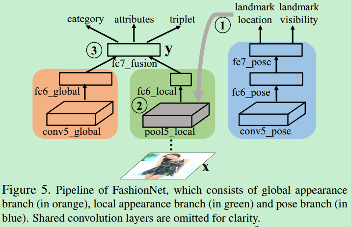
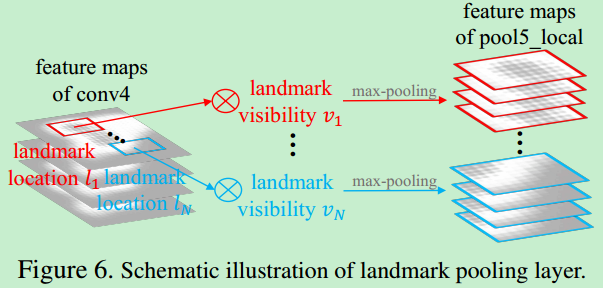

FashionNet-Chainer
====

背景
----
来自于香港中文大学Ziwei Liu等人的工作,这项工作提出了时尚关键点检测或时尚对齐（通过三层级联网络）,预测关键点位置上的时尚物品,如领口的角落,裙摆,袖口，通过联合预测服装属性 (clothing attributes) 和关键点(landmarks) 来学习服装特征. 再利用估计的关键点位置来池化(pool/gate) 学习的特征. 以迭代的方式进行.

基本结构
----
基础网络采用 VGG16 . 从开始到倒数第二层，与VGG16相同，最后一个卷积层重新设计用于服装问题. 如图：

Figure 5. FashionNet 结构. 包括全局特征分支(橙色部分)，局部特征分支(绿色部分)，pose 分支(蓝色分支). 其中，忽略了共享卷积层.

全局特征分支—— 整个服装商品的全局特征；

局部特征分支—— 由估计的服装关键点池化(pooling) 得到服装的局部特征；

Pose分支—— 预测关键点位置及其可见性(可见性指，关键点是否存在).

橙色分支和绿色分支的输出在 fc7_fusion 层连接，以联合预测服装类别、属性，对服装对建模.

关键点池化层
----
关键点池化层是 FusionNet 的重要组成. 如图：

landmark pooling 层的输入是 feature maps(如 conv4 ) 和 估计的 landmarks.

针对每一个关键点位置 ll,

首先，确定其可见性 vv. 不可见关键点的响应设为 0；

然后，对关键点周围区域进行 max-pooling 操作，以得到局部 feature maps，并堆积成为 pool5_local 层的最终 feature maps.

landmark pooling 层的反向传播类似于 Fast R-CNN中的 RoI pooling 层. 不同之处在于，Fast R-CNN中的 RoI 层将池化的区域(pooled regions) 独立对待，landmark pooling 层通过连接局部特征来捕捉不同服装关键点的交互关联性(interaction).

数据集
-----
[deepfashion](http://mmlab.ie.cuhk.edu.hk/projects/DeepFashion.html)
